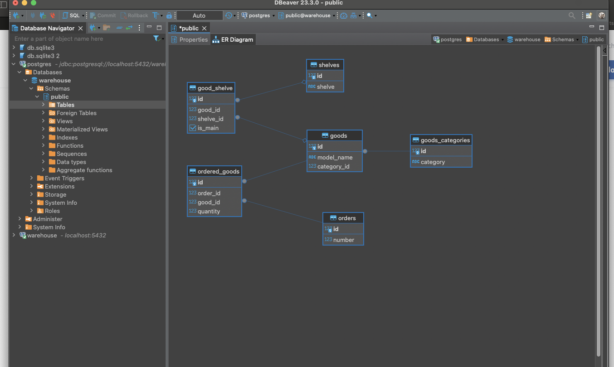
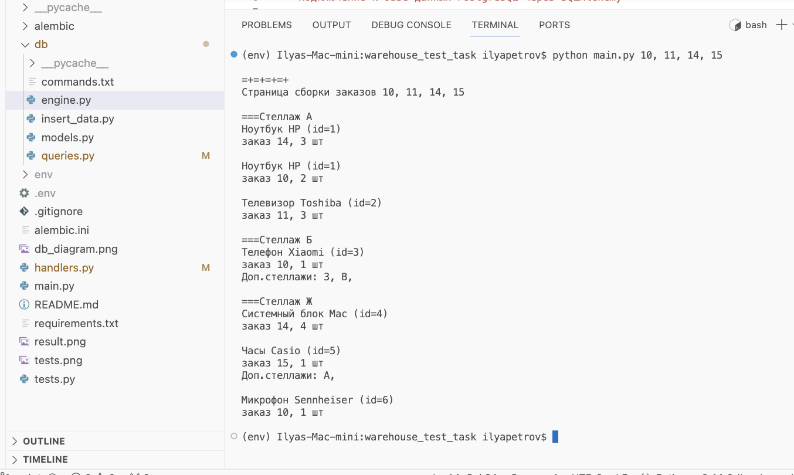

  
  
  
  

## Склад
Реализация консольной программы, которая выдает информацию по всем заказанным товарам

## Архитектура приложения

  

## Ограничения БД
- категория товара должна быть уникальной
- модель товара может иметь только один главный стеллаж
- названия главных стеллажей могут быть неуникальными
- модель товара должна быть уникальной
- модель товара может иметь один или несколько вспомогательных стеллажей
- номер заказа должен быть уникальным
- номер заказа и товар в нем должны быть уникальными

## Ключевые особенности
- взаимодействие программы и БД происходит через ORM SQLAlchemy
- благодаря оптимизации происходит суммарно три запроса к базе данных
- в первую очередь идет сбор информации по вспомогательным стеллажам
- итоговый результат отсортирован по главным стеллажам

## Пример работы

  

## Тесты

  

## В будущем
- подключить Redis, чтобы закэшировать информацию по вспомогательным стеллажам и, таким образом, снизить нагрузку на БД
- добавить индексы для ускорения поиска информации в БД
